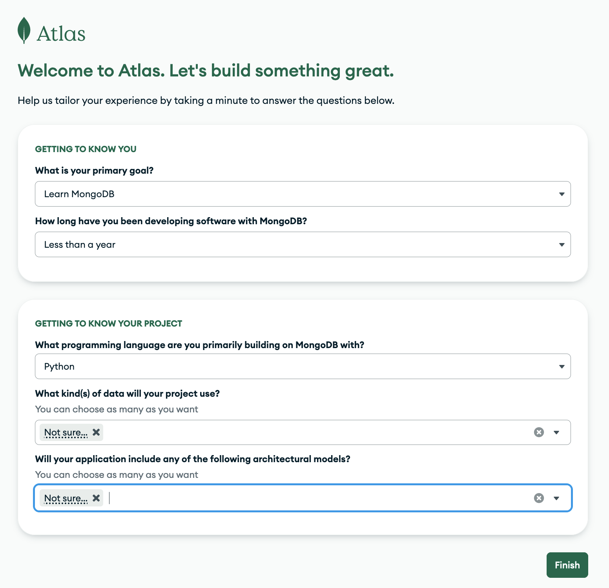
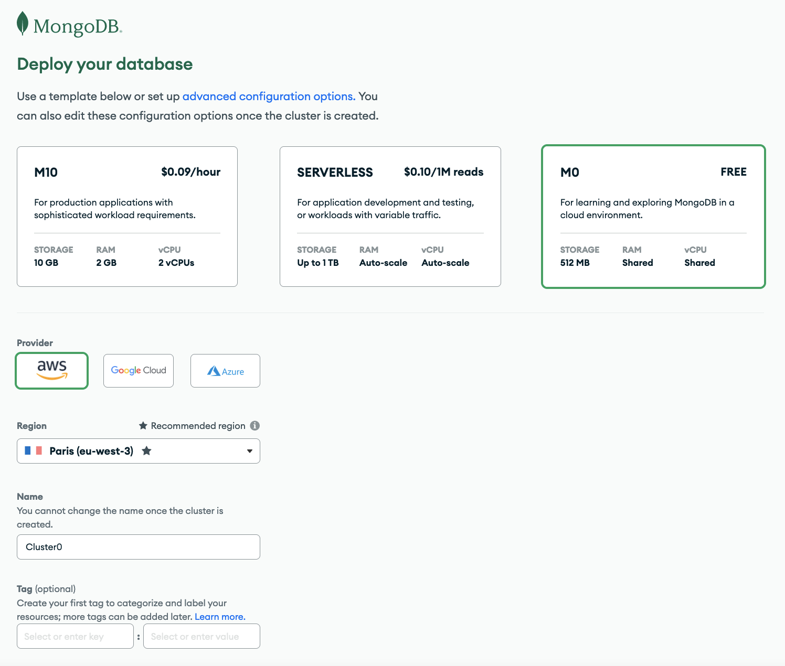
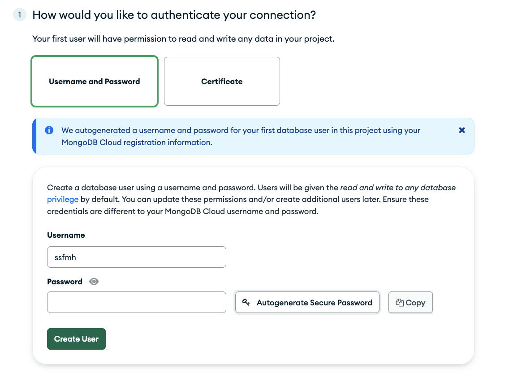
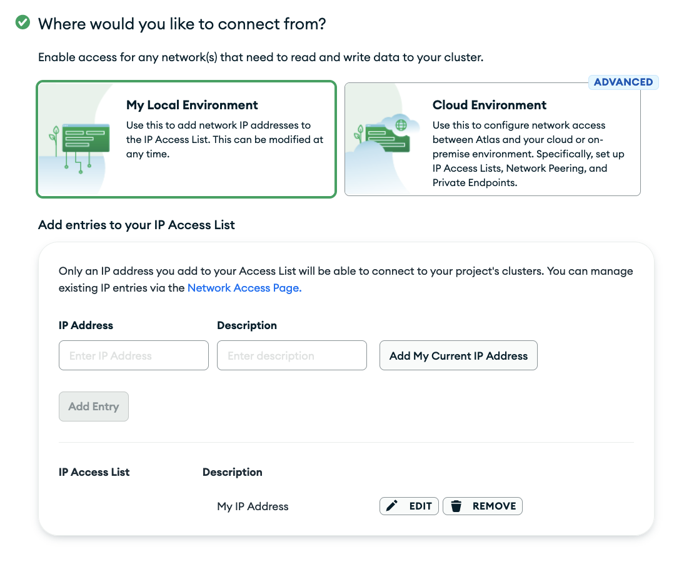

# Créer un cluster sur MongoDB.com

## Créer un compte [MongoDB.com](https://www.mongodb.com/fr-fr)

## Ensuite, après la vérification d'email : 

### Premier formulaire (préférences utilisateur)

**(pas très important, mais augmente les chances d'à avoir les mêmes interfaces pendant le cours)**

### Second formulaire (création du cluster)

#### Choisir : 

- Deploy your database: **M0 Free**
- Provider : **AWS**
- Region : **Paris (EU West)**
- Name : **Cluster0**

### Troisième formulaire (sécurité)

#### Choisir : 

- Authentification avec username et password **Penser à sauvegarder le mot de passe**
- Se conncter depuis sa marchine : ajouter son IP

